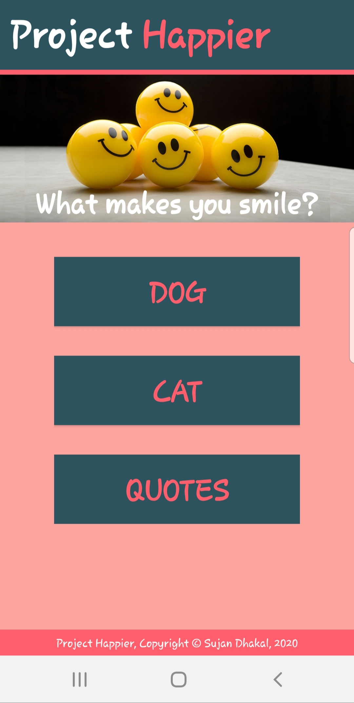
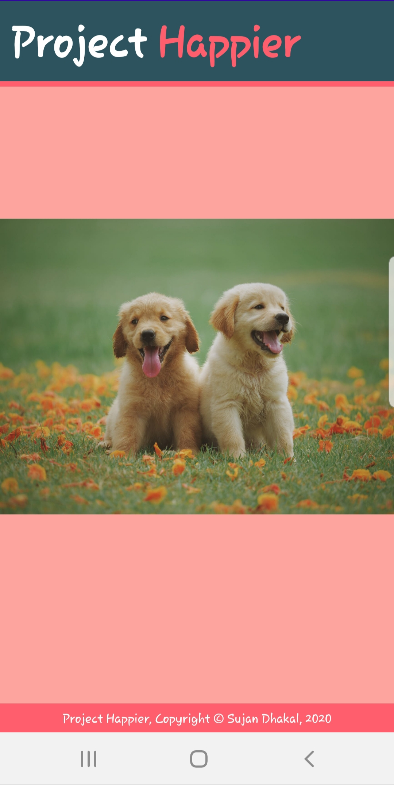
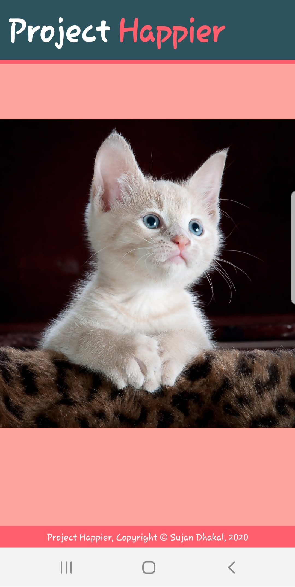
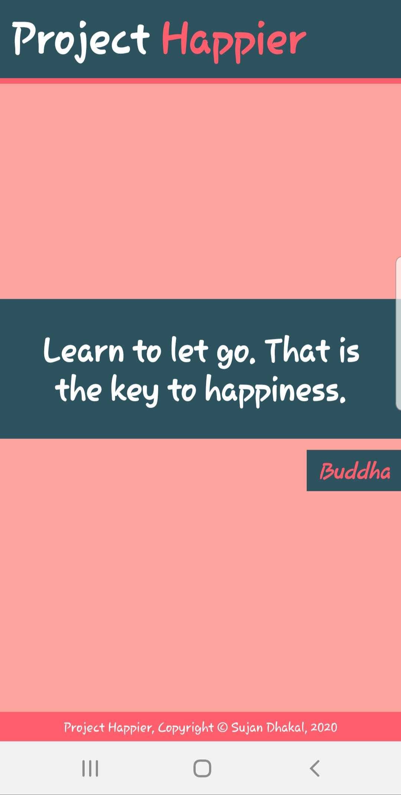

# Project Happier
  - An interactive android app to make you smile for the day- Project Happier. 
  - Developed in Java (Android Studio)
  - Developer: Sujan Dhakal
  - © 2020, Sujan Dhakal. All Rights Reserved. 
  
About Project Happier:
  - An android app where you can view the random pictures of dog and cats, or read motivational quotes to make your day. (More pets like fish, rabbit coming soon.)
  
How to run?

    - Clone the repo and open it using Android Studio.
    - Make Project and Run. 

Previews:

                 

                  
